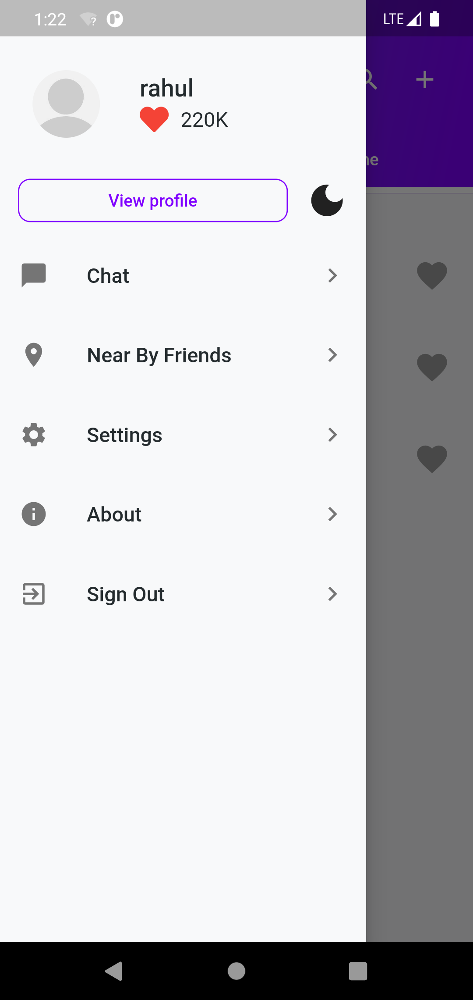

# lite_chat

A simple chat application to meet new people from nearby and make friends with them. The application uses firebase authentication for user registration, realtime database and user location to connect nearby users.<br>
The application is in its developing stage, only the UI part is almost done.

## ✍ To dos
- [ ] Use Firestore to store user datas
- [ ] Implement BLoC to separate business logic from UI 
- [ ] Check and make app responsive for all screen sizes
- [ ] Application testing

## 📱 Screenshots
&ensp;&ensp;
&ensp;&ensp;
&ensp;&ensp;
&ensp;&ensp;
#### Dark Mode -
&ensp;&ensp;
&ensp;&ensp;
&ensp;&ensp;

#### Light Mode -
&ensp;&ensp;
&ensp;&ensp;
&ensp;&ensp;


 
## 💻 Test application on your machine
Open CMD from where you want to clone the project & run the following commands:
```
  git clone https://github.com/x-abgth/lite_chat.git
```
```
  cd lite_chat
 ```
 ```
  flutter packages get
 ```
 ```
  flutter run
```
## ❤ Conclusion
🌟 Star this repo & follow for more 😊

<a href="https://www.buymeacoffee.com/abgth" target="_blank"></a>

